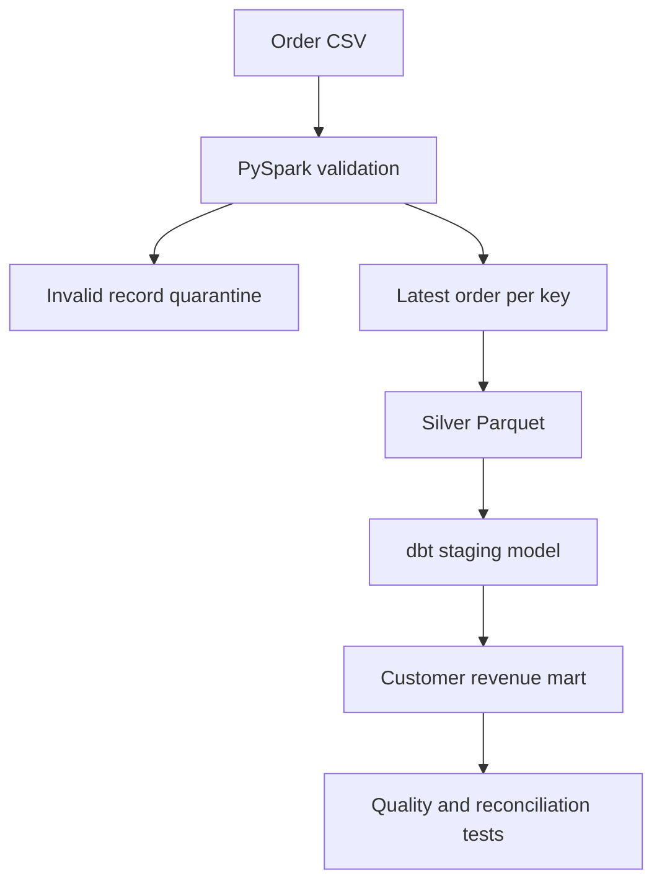

# PySpark ingestion + dbt analytics

**Client outcome:** repeatable, tested customer revenue reporting from imperfect order extracts.

Spark validates and deduplicates CSV orders into Parquet. dbt uses **DuckDB** to read that Parquet and materialize staging and customer revenue models. This is a portable PySpark + dbt workflow; dbt does not execute on Spark in this example.

## Run
Requires Python 3.12 and Java 17. Clone this repository, then run from its root directory:

```bash
python -m venv .venv
source .venv/bin/activate
# Windows PowerShell: .venv\Scripts\Activate.ps1
python -m pip install -r requirements.txt
```

```bash
python -m pytest -q
python ingest.py
dbt debug --profiles-dir .
dbt build --profiles-dir .
dbt docs generate --profiles-dir .
# Optional interactive lineage documentation:
dbt docs serve --profiles-dir .
```

Expected staging count: 4. Expected revenue across customer groups: 290.00. Tests enforce unique order/customer keys, non-null fields, nonnegative totals, and source-to-mart revenue reconciliation. Inspect `target/run_results.json` for actual dbt test results.

`output/retail.duckdb` holds the models. Both ingestion and models rebuild snapshots; this avoids pretending the small demo implements incremental change capture. To adapt for a Databricks client, replace the DuckDB profile with dbt-databricks, replace the Parquet table function with a governed source table, and validate incremental/late-arrival semantics separately.

## Demo
Change one valid amount in the source, rerun ingestion and dbt, and trace the new total through staging and the customer mart. Show dbt tests and the model lineage.

References:
- https://docs.getdbt.com/docs/get-started-dbt
- https://duckdb.org/docs/stable/data/parquet/overview

## Architecture



## Expected demo result

| Check | Expected |
|---|---:|
| Source rows | 7 |
| Invalid rows | 2 |
| Superseded duplicate rows | 1 |
| Curated unique orders | 4 |
| Total revenue | 290.00 |

The duplicate O1 retains its latest amount of 120.00. Invalid and negative amounts are quarantined. Unknown customer C9 is retained to avoid silently losing revenue.

## Portfolio demo

This self-directed example uses synthetic data, not an actual client engagement. Show the imperfect input, Spark quality metrics, passing dbt tests, and generated lineage to explain how you can build trustworthy reporting for a client. No customer savings or production deployment are claimed.

GitHub Actions installs Python/Java, runs the Spark test, runs ingestion and dbt build, and uploads the quality metrics and dbt test report. dbt runs on DuckDB here, not a Spark SQL endpoint. No cloud account is required.
